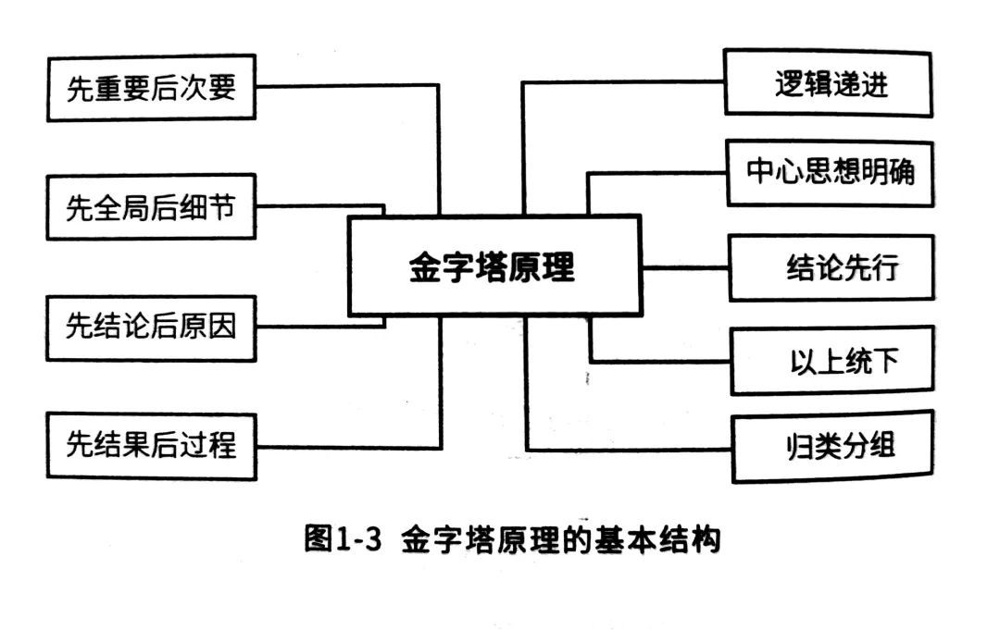

# 解决问题的方法

整体以领域驱动设计中解决问题的办法为框架，填充金字塔工作法，结构化分析法等各种其他方法为补充。定义一个解决问题的框架。这个框架是有先后顺序的，以顺序的方式逐步的解决问题。不使问题和解决方案、要解决的问题和解决问题的框架纠缠在一起。

## 问题域

一般情况下遇到问题时都是需要先明确问题的内容。找到问题的突出矛盾点，然后在对其进行分析和解决才是有效的过程。如果只知道有一个问题，但是不知道范围，没有上下文，那制定出来的解决方案很有可能解决不了当前问题。明确问题的各个方面，问题的范围是什么样的？问题的相关利益者是谁？问题解决的优先级。

例如：之前接触过一个项目只有一句话的需求：要有一个自动化的机床控制。其实从这个角度看是一个只能生产线的项目，但是去跟项目发起方一对接就会发现他们要的是做全工厂内个厂房的机器互联解决方案。这两个方向根本就是不同领域的两个问题。

### 先全局后细节（金字塔工作法）

结构化思维模式，先整体后局部。逐层拆解，要做的工作。这样就不会觉得问题太多永远也解决不完。拆分完成之后以填充的方式将拆解出来的问题一步一步的填充，就可以看到整体进度。

### 优先级

明确问题中每个部分的优先级。以方便之后进行解决问题的排序。这样可以以最高的效率投入到问题解决方案中。

1. 使用重要、紧急分析进行优先级定义。
2. 使用业务价值进行优先级定义。

定义优先级其实是寻找问题最主要矛盾的过程。并不是只为了排出来解决问题的优先级。针对主要矛盾进行解决方案的制定和最终客户要的解决方案可能相差很远，但是可以最好的方式解决问题。

### 整理方法

通过各种各样的工具了解系统：事件风暴、客户旅程图、价值流图、价值链、采访、访谈的方式进行。使用MECE\(相互独立、完全穷举）的方法。使用鱼骨图进行根因分析。使用5w2h法进行问题定义。使用优劣势分析法进行优劣势分析。

### 定义指标

定义指标对于解决域是非常有用的。可以通过对比指标的方式进行解决方案的优劣的对比。在指标的指导下可以更快的找到对应的方案。例如：

1. 在租房的情况下需要安装空调；
2. 在新房装修的情况下选择空调。

这两个的指标定义是截然不同的。

## 方法论

方法论有很多，针对当前问题场景下的解决方法也很多

### 解决问题的约束

1. 解决问题是否有约束？
2. 是否对现在的解决方案可以进行变动？变多的可能性？
3. 投入解决这个问题的人员、组织、规范是什么样的？

### 解决这个问题又哪些方法论可以供参考

1. 是否可以使用PDCA？
2. 是否可以持续的演进这件事情？

## 解决域

通过对问题进行抽象、分解和知识的过程去解决问题。

### 结论先行（金字塔工作法）

现将结论、整体解决方案呈现在解决方案的第一页，让大家对于解决方案有一个全局的认识。然后再进行相关的细节说明。

### 归类分组（金字塔工作法）

#### 归类、抽象

为了更好的提供一类问题的解决方案，最好将问题进行归类，并将解决方案进行归类。以统一的解决方案完成一类问题的解决。

#### 分组、分解

按照分解的思维方式对问题空间进行分组，而后逐个进行攻破。一个大的问题可能无从下手，而将问题分解为一个一个的小问题之后就很好下手了。

### 分析&权衡

对于一件事情来说，解决方案可以是各种各样的。但解决方案的各项属性可能会有着很复杂的关系。例如：在购买手机时，性价比和外观可能是一对需要取舍的内容。有很漂亮的外观的手机可能会很贵，有很高性价比的手机可能就是比较厚。所以在选择问题的解决方案时需要取舍。在取舍中最重要的是符合当前的场景诉求。例如给我女儿买手机时可能考虑不能让她沉迷，买个丑的，但是耐用的就很好。

### 切实落地

解决方案必须是可落地，可实施的方案。一些方案可能在一些团队可落地，但是在另外一些团队几乎不可能落地。例如在阿里可以做中台，但是在5线小公司里面中台就无法落地。这里需要考量的内容非常之多。

切实落地要考虑：

1. 团队能力，团队组成
2. 团队协作关系
3. 问题难度，解决方案复杂度
4. 方法论掌握程度
5. 业务能力

### 具体内容

1. 最终成果
2. 以及达成最终成果的的步骤。包括：资源、时间、范围、质量等方面的内容
3. 成本
4. 可能还包括方案对比，例举出几个方案的优缺点，在评审或方案决策中可以使用

## 参考

金字塔工作法

领域驱动设计

